<p align="right">
            Read this page in other languages:<a href="../docs-jp/Docs/tool-flow-tutorials.md">日本語</a>    <table style="width:100%"><table style="width:100%">
  <tr>

<th width="100%" colspan="6"><h1>Vitis Software Platform: Embedded Vision Reference Platforms User Guide 2019.2 (UG1265)</h1>
</th>

  </tr>
  <tr>
    <td width="17%" align="center"><a href="../README.md">1. Introduction</a></td>
    <td width="16%" align="center"><a href="overview.md">2. Overview</a></td>
    <td width="17%" align="center"><a href="software-tools-system-requirements.md">3. Software Tools and System Requirements</a></td>
    <td width="17%" align="center"><a href="design-file-hierarchy.md">4. Design File Hierarchy</a></td>
</tr>
<tr>
    <td width="17%" align="center"><a href="operating-instructions.md">5. Installation and Operating Instructions</a></td>
    <td width="16%" align="center">6. Tool Flow Tutorials</td>
    <td width="17%" align="center"><a href="run-application.md">7. Run the Application</a></td>
    <td width="17%" align="center"><a href="platform-details.md">8. Platform Details</a></td>    
  </tr>
<tr>
    <td width="17%" align="center" colspan="2"><a href="known-issues-limitations.md">9. Known Issues and Limitations</a></td>
    <td width="16%" align="center" colspan="2"><a href="additional-references.md">10. Additional References</a></td>
</tr>
</table>

# 6. Tool Flow Tutorials

To test the platforms, the Vitis™ software platform, version 2019.2, must be installed and working on your host computer in Linux only.

This guide walks you through the process of building the sample designs. In the [Software](software-tools-system-requirements.md#32-software) step, you unzipped your platform files, and noted the exact directory paths.

The path to the extracted platform is required so that you can tell the Vitis software platform where your custom platform resides. Set the sysroot environment variable to point to a directory where sysroot is present. The PetaLinux BSP section in <a href="platform-details.md">Platform Details</a></td> shows how to generate the sysroot with the help of the PetaLinux BSP file given for each platform. The platform root directory is abbreviated to `<platform>` below and needs to be replaced with your local path. In case of Linux, this environment setting has to be from the Linux terminal where you are opening the Vitis environment:

Vitis Platforms:
* Linux: `export SYSROOT=<SYSROOT_PATH>/sysroot/aarch64-xilinx-linux/`

## 6.1. Single Sensor Platform

<details>
<br>
            
            
The Single Sensor platform ships with three live I/O design examples demonstrating popular OpenCV functions accelerated on the programmable logic. With this release of the embedded vision reference platforms, the live I/O sample design examples are based on [GStreamer](https://gstreamer.freedesktop.org). The open-source GStreamer framework code is included with the vision platform, and design examples are built as GStreamer plugins. Code for test applications is provided as well, allowing you to compile apps that set up and run video pipelines using the plugins. Pipelines can be run using the `gst-launch-1.0` utility.


A GStreamer plugin is a shared library. In the case of the embedded vision reference platform sample designs, the GStreamer plugin consists of two linked parts. The top part is a set of shared libraries, and the bottom part generates the `*.xclbin` file, which contains information about the accelerator built on top of the platform. The top part is generated by importing workspaces for each sample from `./workspaces/<name>` and building them. The bottom part is generated by creating an application project in the Vitis software platform and building the sample in the `./workspaces/samples/live_IO/<name>` directory.

The shared libraries generated by the top part are for XRT base class, the XRT allocator for DMABUF, ``gstsdx`` base class, the XRT mapping layer with the GStreamer framework, and a sample-specific GStreamer plugin. See the `./workspaces/<name>` directory. This top part links with the bottom part, which contains the code for the hardware accelerated function(s). This bottom project generates the `BOOT.BIN` and `*.xclbin` file containing the programmable logic used for the hardware function(s).

### 6.1.1. Build the Live I/O Stereo Sample Application

There is a` ./workspaces/...` folder structure already set up for the three `live_IO` samples as part of the platform package:
```
├── workspaces
│   ├── ws_f2d
│   ├── ws_of
│   ├── ws_sv
```

Copy these workspaces to the directory where you want to work. Go to one of the subdirectories under ``workspaces``. For an example, look at the `ws_sv` workspace area described in below tree supplied with the platform. The `./ws_sv/gst/`, `./ws_sv/xcl_stereo/`, and `./ws_sv/xrtutils/` directories are software workspaces required for GStreamer to communicate with a stereo kernel through an XRT mapping layer.

:pushpin: **IMPORTANT**: Some of the projects are duplicated for these subdirectories (for example, ``xrtutils``, ``gstsdxbase``, and ``gstsdxallocator``). Go to one of the subdirectories (for example, ``ws_f2d``, ``ws_of``, or ``ws_sv``), open the Vitis software platform, and import the project under that subdirectory instead of opening the Vitis software platform from the ``workspaces`` directory.

The `./ws_sv/stereo` directory shown below is the Vitis project you create to build the low-level stereo accelerator code. You create this stereo Vitis project directly under the ``ws_sv`` workspace.

```
├── ws_sv
│   ├── gst
│   │   └── allocators
│   │        └── gstxclallocator.c
│   │        └── gstxclallocator.h
│   │   └── base
│   │        └── gstsdxbase.c
│   │        └── gstsdxbase.h
│   │   └── plugins
│   │        └── gstsdxstereo
│   │            └── gstsdxstereo.cpp
│   │            └── gstsdxstereo.h
│   │            └── stereo_cv.cpp
│   │            └── stereo_cv.h
│   │            └── BtoWrgb_table.h
│   │            └── gstsdxstereo.cpp
│   │            └── BtoWyuv_table.h
│   ├── xcl_stereo
│   │        └── stereo_sds.cpp
│   │        └── stereo_sds.h
│   ├── xrtutils
│   │        └── xcl2.cpp
│   │        └── xcl2.hpp
│   │        └── xrt_mapping_buffer.h
│   │        └── xrtutils.cpp
│   │        └── xrtutils.hpp
│   └── stereo
│       └── src
│           ├── xf_stereo_pipeline_accel.cpp
│           └── xf_stereo_pipeline_config.h
│           └── xf_config_params.h
│           └── BtoWyuv_table.h

```

For a given workspace, such as `./workspaces/`, where ``ws_sv`` is a subdirectory, the arrangement of these subdirectories must be preserved. This is because the various projects depend on each other in that they need to know the paths to each other's include files and library files. As long as you keep this structure, you're OK; you can copy the `./ws_sv/` tree with everything just as shown, and put it anywhere you want to work.

**:pushpin: NOTE**
>If you are working in Linux (the Vitis software platform is only supported by the Linux OS in 2019.2), there is no restriction on where you put these workspaces. Some people want to work directly in the` ./workspaces/` directory under the platform itself, and others prefer to copy it elsewhere so that the original area remains untouched.

#### 6.1.1.1. Import Existing GStreamer Workspaces

This section uses the `stereo` sample workspaces to demonstrate how to import and compile the GStreamer workspaces.

1. Start the Vitis software platform and select workspace `./workspaces`. Make sure you use the same shell to run the Vitis software tool as the one where you have set `$SYSROOT` using the `export` or `setenv` command.

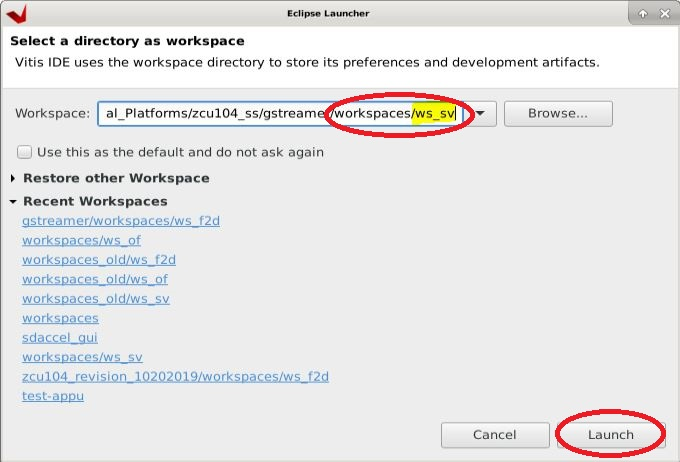

2. Close the **Welcome** screen and type "Import" into the **Quick Access** at the top of the window. Select the **Import (Existing Projects into Workspace) - Import** option.

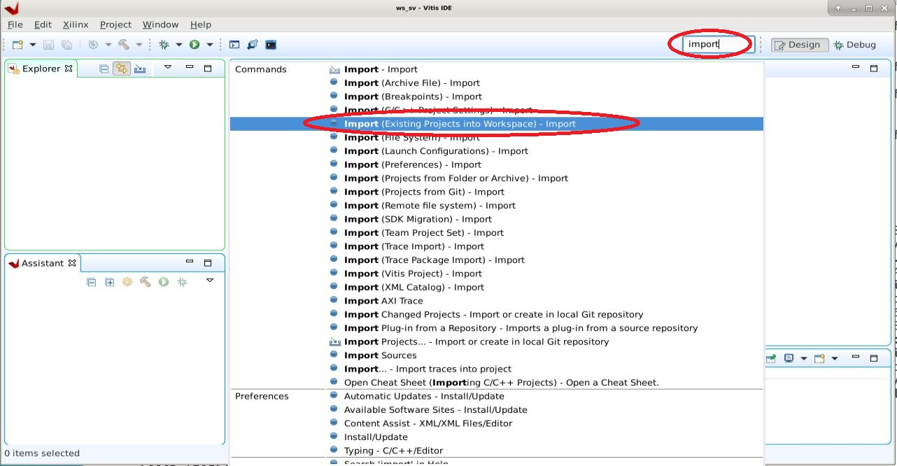

3. In the Import Projects dialog, to the right of Select root directory, click **Browse**.

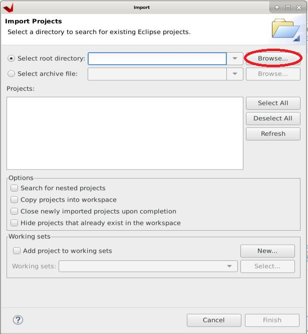

4. Select the directory you want; `./workspaces/ws_sv`. Click **OK**.

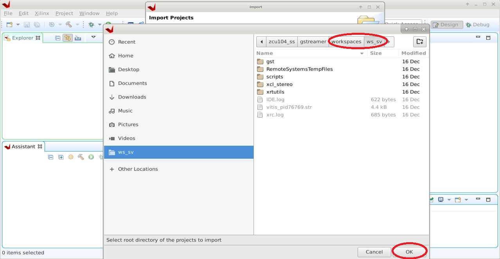

5. You should see a list of projects with ``gstsdxbase``, ``gstsdxstereo``,  ``gstsgstxclallocator``, ``xcl_stereo`` and ``xrtutils`` selected. Click **Finish**.

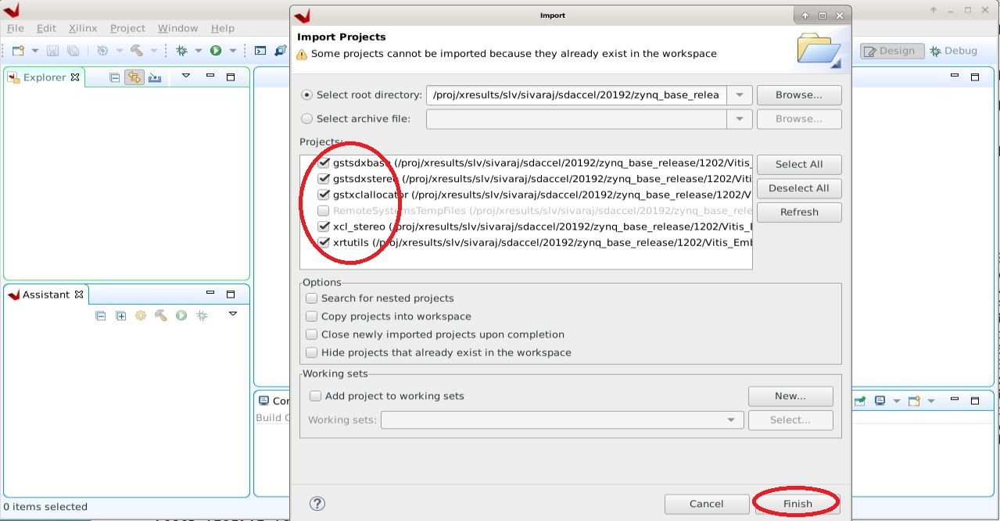

6. Back at the main window, the imported project appears in the Project Explorer pane. Wait for the projects to be loaded and indexed.

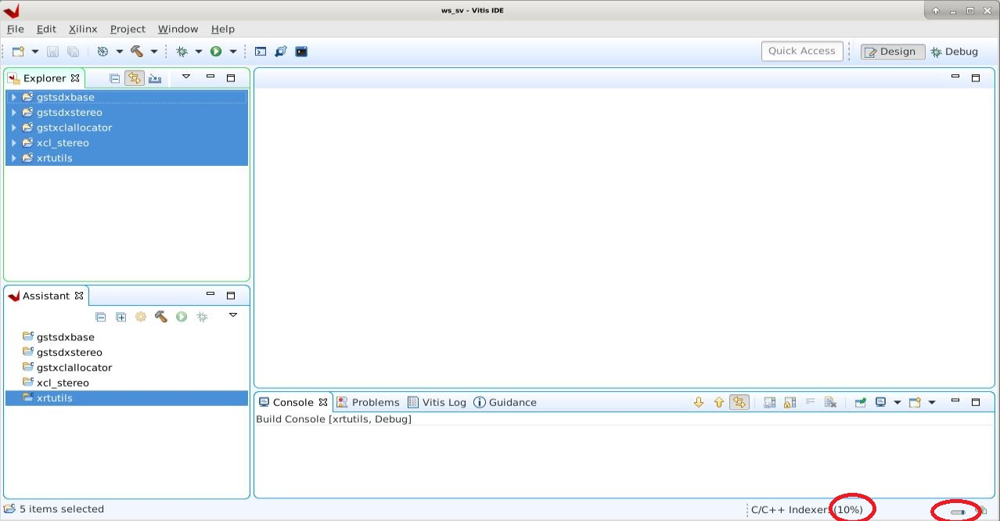

7. Right-click on the **xcl_stereo** workspace and select the **C++ Build Settings**. Select **Includes** under the g++ Compiler, click on **+**, and remove any existing text in the Add directory path window that opens. Add the ``xfopencv`` include directory that is present in the platform path using the **File System** button, and click **OK**.

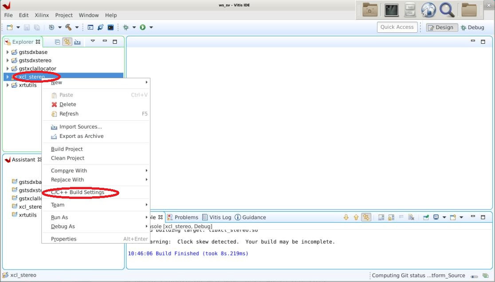

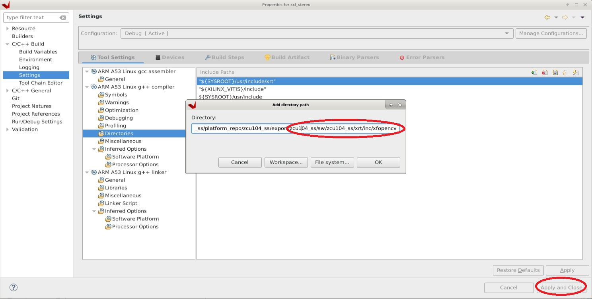

**:pushpin: NOTE**
> This ``xfopencv`` include path should be added for other sample XRT mapping layer workspaces as well. They are `xcl_filter2d` project for the filter2d sample, and the `xcl_opticalflow` project for the opticalflow sample.

8. Click **Apply** → **Yes** → **Apply and Close**. Wait for the C/C++ indexer at the bottom right corner of the window to complete.

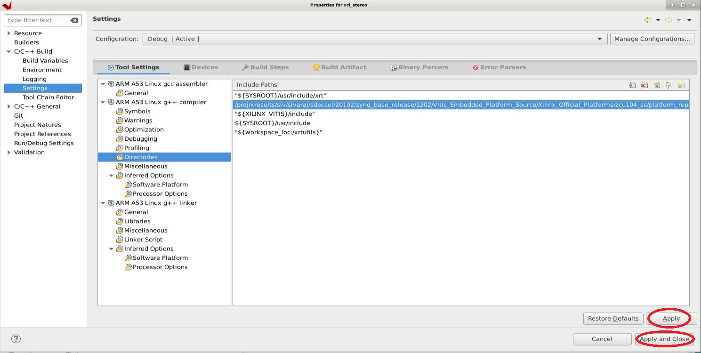

9. Build all the five workspaces by selecting all and clicking the **Debug** button. Doing this creates .so files inside the `Debug` folder for each workspace. In this case, you should see five .so files created from the five projects. Resolve compilation errors (if any) by setting the Arm™ GCC compiler include path settings under C++ build settings for each workspace. You will need to transfer these .so files to your SD card.


#### 6.1.1.2. Create Application Project

This section uses the `stereo` sample kernel to demonstrate how to build the kernel.

1. Select **File** → **New** → **Application Project...** from the menu bar.

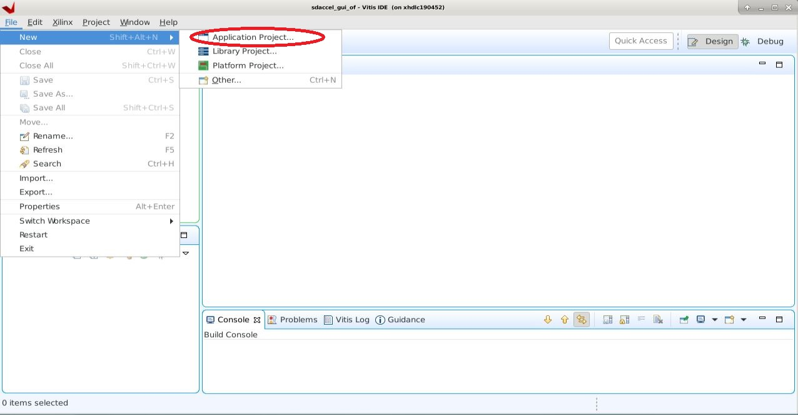

2. In the New Application Project dialog, enter the project name, `stereo`, and click **Next**.

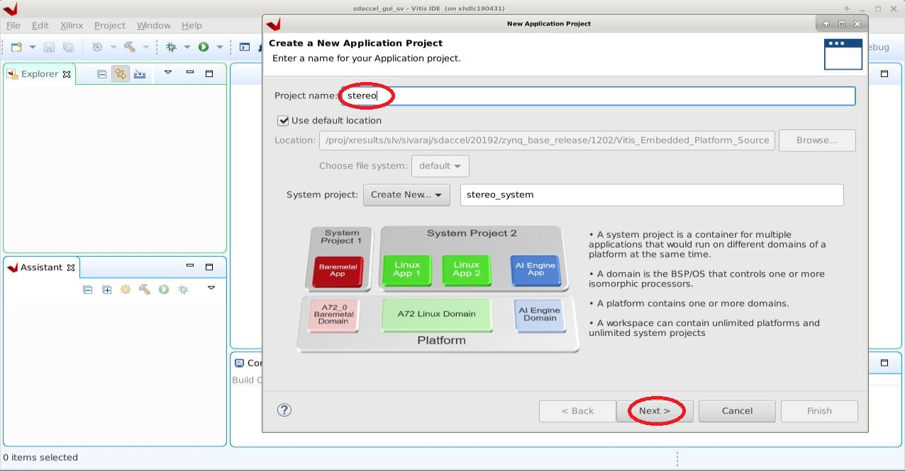

3. This brings up the platform selection window. Click **+**, and click **Next**.

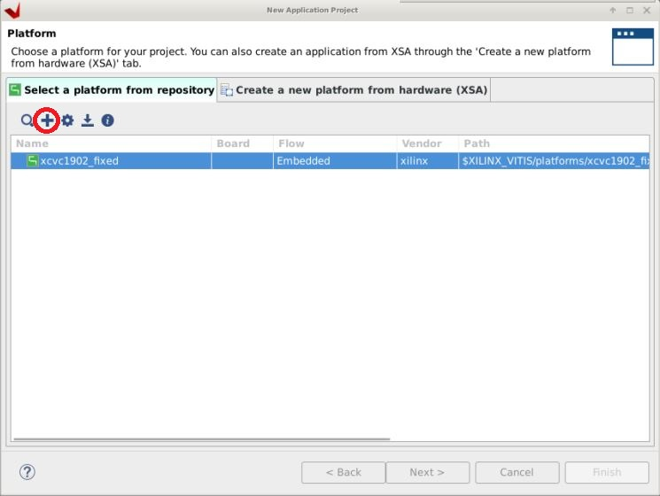

#### 6.1.1.3. Add Custom Platform

1. Select **File System**, and find your way to the top directory where you unzipped the Single Sensor platform (for example, `zcu104_ss`). Click **OK**.

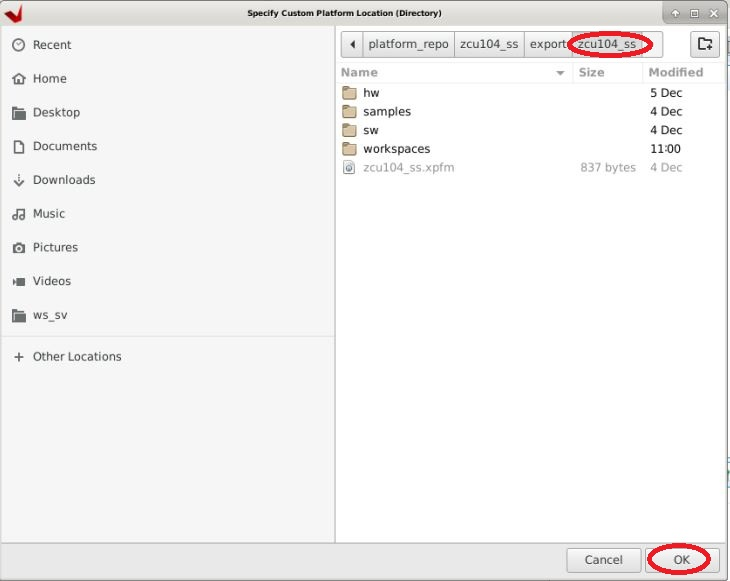

2. Back in the Platform dialog, the new platform appears in the list, but is not selected. Select it, then click **Next**.

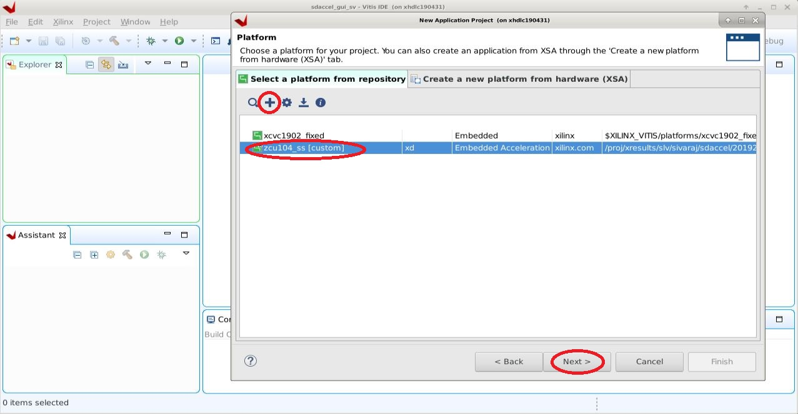

3. Click **Next** again in the following window, and give the sysroot path. Download the sysroot for the Arm™ AARch64 from the web where the pre-built platforms are present, and to refer that path here. Click **Next** again.

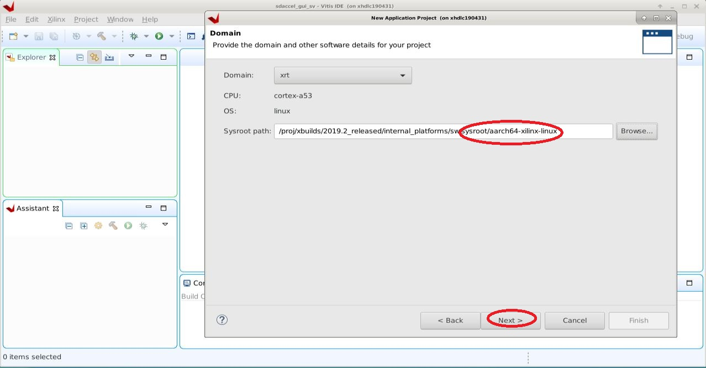

**:pushpin: NOTE**
> Alternatively, the sysroot can be generated by running the script `./sdk.sh` in the PetaLinux folder of the pre-built platform.

#### 6.1.1.4. Select the Live I/O Sample

1. In the Templates dialog, under ``live_IO``, select **Stereo Vision**, and click **Finish**.


Back again at the main window, the new project `stereo` appears under the Project Explorer pane.

#### 6.1.1.5. Set the Build Settings for the C++ Compiler

1. Change the Active build configuration to **Hardware**.

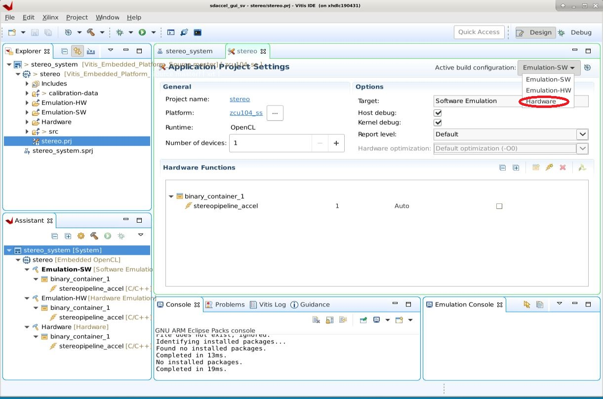

2. Right-click on **stereo** and select **C++ Build Settings**.

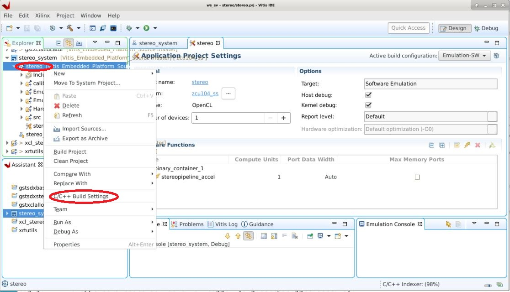

3. Under V++ Kernel Compiler, select **Symbols** , click on **+**, and add `__SDSVHLS__`.

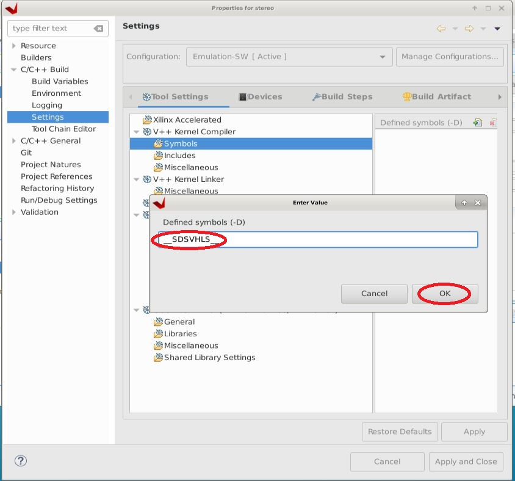

4. Under V++ Kernel Compiler, select  **Includes**, click on **+**, and remove any existing text in the Add directory path window. Add the xfOpenCV include directory that is present in the platform path using the **File System** button, and click **OK**. This path needs to be added for all the three live I/O samples (``filter2d``, ``optical_flow``, and ``stereo``) being built for the Vitis software platform.


5. Click **Yes**, **Apply**, and then **Apply and Close**. Wait for the C/C++ indexer at the bottom right corner of the window to complete.

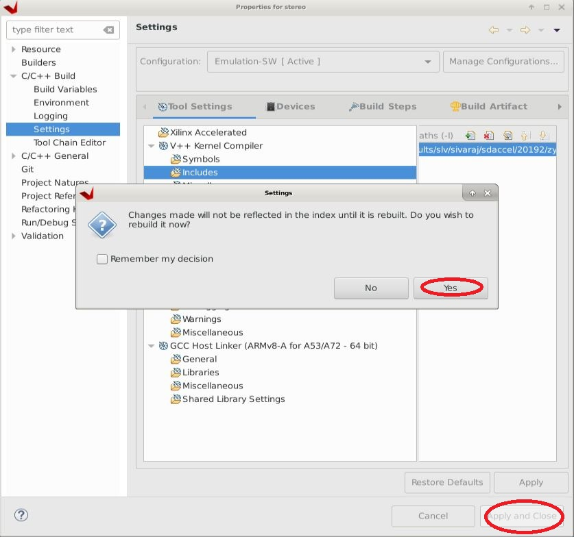

**:pushpin: NOTE**
> Please change the Active build configuration to **Hardware** before doing any C++ build settings. Doing settings first and selecting the Active build configuration later, does not retains the build settings.

#### 6.1.1.6. Build the Project

Build the ``stereo`` project by right-clicking on the **stereo** and choosing **Build Project**, or by clicking the () icon.

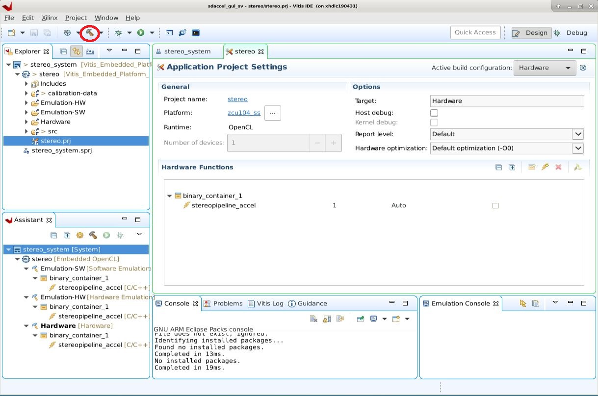

In the small Build Project dialog that opens, click the **Run in Background** button. This causes the small dialog box to disappear, though you can still see a progress icon in the lower right part of the GUI, showing that work is in progress. Select the **Console** tab in the lower central pane of the GUI to observe the steps of the build process as it progresses. The build process can take up to several hours, depending on the power of your host machine, and the complexity of your design. The synthesis of the C code found in C kernel routines into the RTL, and the placement and routing of that RTL into the programmable logic in the Zynq® UltraScale+™ MPSoC, are the steps that take the most time.

When the build completes, an `sd_card` directory is created (`./workspaces/ws_sv/stereo/System/sd_card/) containing the following files that you'll need to transfer to your SD card:

  * `cp ./workspaces/ws_sv/stereo/System/sd_card/binary_container_1.xclbin <sdcard>`
  * `cp ./workspaces/ws_sv/stereo/System/sd_card/BOOT.BIN <sdcard>`
  * `cp ./workspaces/ws_sv/stereo/System/sd_card/image.ub <sdcard>`

### 6.1.2 Build the opticalflow and filter2D Applications

The ``opticalflow`` and ``filter2D`` projects can be created and built using the method just detailed for the ``stereo`` vision project, with the following differences:

1. Launch the Vitis software platform, starting in the appropriate workspace directory: `./workspaces/ws_of`, or `./workspaces/ws_f2d`, respectively.
2. In the Templates dialog, select **Optical Flow** or **Filter2D** respectively.
3. All the other steps are analogous.
</details>

## 6.2. 8-Stream VCU + CNN Platform

<details>
            
<br>

This 8-stream VCU + CNN platform traffic detection and face detection example demonstrates the machine learning capabilities of DeePhi Densebox and SSD neural networks on programmable logic. The DPU Vitis kernel and DNNDK libraries to build with the 8-stream VCU + CNN platform are available in the platform package itself: `zcu104_vcu_ml_2019_2/DPU`.


This example is based on GStreamer. The open-source GStreamer framework code is included with this platform, and design examples are built as GStreamer plugins. Code for test applications is provided as well, allowing you to compile apps that set up and run video pipelines using the plugins. Pipelines can be run by using the gst-launch-1.0 utility.


The GStreamer facedetect and traffic detect plugins have two components each. One component interfaces with the GStreamer framework, and the other links with the DNNDK, which provides C/C++ APIs for deep learning application programming. The build flow for the 8-stream VCU + CNN solution describes using this platform to build a DNNDK project.


### 6.2.1. Build the DPU Project with the 8-Stream VCU + CNN platform

In the current release, the approach to building the DPU project is available through the command line only

1. Copy the DPU project workspace to the directory you want to work on.

2. ``cd`` to ``workspaces/DPU/prj/``.

3. Edit the ``VITIS_PLATFORM`` variable in a zcu104_vcu_ml_2019_2/DPU/prj/Makefile to use the 8-Stream VCU + CNN platform:

  ````
  VITIS_PLATFORM = <pre-built platform path>/zcu104_vcu_ml/zcu104_vcu_ml.xpfm

  ````

4. If needed, update the `workspaces/DPU/prj/config_file/prj_config` and `workspaces/DPU/prj/dpu_conf.vh` files to change the DPU configuration and set the platform port connections to DPU.

5. Ensure the Vivado, Vitis, and XRT environments are properly set to build this. This ensures the required variables in the Makefile are properly set.

   ```
   source <vitis_intstall_path>/installs/lin64/Vitis/2019.2/settings64.csh
   source <vitis_intstall_path>/xbb/xrt/packages/setenv.csh
   
   ```
6. Run ``make`` in the command line. This builds the DPU project for the 8-Stream VCU + CNN platform.

7. When the build completes, copy the built images to ``sdcard``:

* `cp <DPU_workspace>/binary_container_1/sd_card/BOOT.BIN <sdcard>`
* `cp <DPU_workspace>/binary_container_1/sd_card/image.ub <sdcard>`
* `cp <DPU_workspace>/binary_container_1/sd_card/dpu.xclbin <sdcard>`

### 6.2.2. Build the Libraries and GStreamer Plugin

Copy the required prebuilt libraries that are present in the ``workspaces/sdcard`` directory to the SD card for booting on the ZCU104 board for evaluating the 8-Stream VCU + CNN platform:

* `cp workspaces/sdcard/libn2cube.so <sdcard>`
* `cp zworkspaces/sdcard/libdpuaol.so <sdcard>`
* `cp workspaces/sdcard/libhineon.so <sdcard>`
* `cp workspaces/sdcard/libgstsdxtrafficdetect.so <sdcard>`
* `cp workspaces/sdcard/libdpumodelssd.so <sdcard>`
* `cp workspaces/sdcard/libgstxclallocator.so <sdcard>`
* `cp workspaces/sdcard/libgstsdxbase.so <sdcard>`
* `cp workspaces/sdcard/libxrtutils.so <sdcard>`
* `cp workspaces/sdcard/libgstsdxfacedetect.so <sdcard>`
* `cp workspaces/sdcard/libdpumodeldensebox.so <sdcard>`

Some of these libraries can be created from the workspaces given with this package, as described in the following section. The generated libraries can be used instead of the pre-built libraries from the SD card.

#### 6.2.2.1. Import Existing GStreamer Workspaces

Follow the below steps to build workspaces ``libgstxclallocator.so``, ``libgstsdxbase.so``, ``libxrtutils.so``, ``libgstsdxfacedetect.so``, and ``libgstsdxtrafficdetect.so``. This step is required if you want to build workspaces and generate .so files instead of using the ones present in the ``workspaces//sdcard`` prebuilt directory. The model libraries for facedetect, trafficdetect, `libdpumodeldensebox.so`, and `libdpumodelssd.so` respectively are available as pre-built only.

1. Extract the sysroots by following the [Platform Build Instructions](design-file-hierarchy.md#42-platform-build-instructions). This extracts the following components:

* ``environment-setup-aarch64-xilinx-linux``
* ``site-config-aarch64-xilinx-linux``
* ``sysroots``
* ``version-aarch64-xilinx-linux``

Alternatively, download the [``zynqmp`` sysroot](https://www.xilinx.com/support/download/index.html/content/xilinx/en/downloadNav/embedded-platforms.html) from the Xilinx website.

2. Set the ``SYSROOT`` path in the shell, or add the following code to your startup script:

* `setenv SYSROOT <sysrootextractdir>/sysroots/aarch64-xilinx-linux` (for csh)
* `export SYSROOT=<sysrootextractdir>/sysroots/aarch64-xilinx-linux` (for bash)

3. Create your own workspace, and copy the contents of ``zcu104_vcu_ml_2019_2/workspaces/`` to your workspace.

`cp -rf zcu104_vcu_ml_2019_2/workspaces/* <workspace>`

4. Make sure you set the sysroot from the terminal where you are invoking the Vitis GUI, as shown in the previous step. Start the Vitis IDE, and select the workspace directory where you have copied the contents of `workspaces` to build the library from sources. Click the **Launch** button. 


5. Close the Welcome screen and type **import** into the quick access toolbar. Click on **Import (Existing Projects into Workspace) - Import**.


6. In the Import Projects window, to the right of the Select root directory, click **Browse**.


7. Select your workspace directory where all the GStreamer projects are present and click **OK**.


8. Select the projects to add for the build, and click **Finish**. Wait for the `C/C++ Indexer` to be completed to 100%.


9. Select all the projects and build by clicking the hammer () icon. This generates the required libraries and application executables in the respective **Debug** folders of each of the projects. These projects are interdependent on other projects. If you are building any of the projects independently instead of building all projects at once, check the build errors in the Vitis GUI console to see if looking for a dependent library is mentioned, and then build that project accordingly.


#### 6.2.3. Final Steps

1. Copy the ``libgstxclallocator.so``, ``libgstsdxbase.so``, ``libxrtutils.so``, ``libgstsdxfacedetect.so``, and ``libgstsdxtrafficdetect.so`` libraries along with the ``rtsp`` application executable to the `<sdcard>` directory generated by building the workspaces in the previous step.

2. Copy the pre-built facedetect and trafficdetect models (for 480x360 resolution) from the `sdcard` folder to `<sdcard>`:

* `cp workspaces/sdcard/libdpumodeldensebox.so <sdcard>`
* `cp workspaces/sdcard/libdpumodelssd.so <sdcard>`

These models must be rebuilt if the DPU configuration or input resolution is different from what is provided with this package. Refer to the [AI Model Zoo](https://github.com/Xilinx/Vitis-AI/tree/master/AI-Model-Zoo) and the Vitis AI User Guide ([UG1414](https://www.xilinx.com/cgi-bin/docs/rdoc?d=vitis_ai/1_0/ug1414-vitis-ai.pdf) for information on how to rebuild the models.

3. Copy the pre-built DNNDK libraries from the `sdcard` folder to `<sdcard>`:

* `cp workspaces/sdcard/libn2cube.so <sdcard>`
* `cp workspaces/sdcard/libhineon.so <sdcard>`
* `cp workspaces/sdcard/libdpuaol.so <sdcard>`

You are now ready to boot the device with the 8-stream VCU + CNN design.

</details>

## 6.3. ZCU104 Smart Camera Platform

<details>
<br>
            
The ZCU104 Smart Camera example demonstrates the DeePhi Densebox neural network capability with face detection on programmable logic. The DNNDK project to build with the ZCU104 Smart Camera platform is available for free download in the Xilinx AI developer hub (not yet available).


This example is based on [GStreamer](https://gstreamer.freedesktop.org/). The open-source GStreamer framework code is included with the reVISION platform, and design examples are built as GStreamer plugins. Code for test applications is provided as well, allowing you to compile apps that set up and run video pipelines using the plugins. Pipelines can be run by using the `gst-launch-1.0` utility.


The GStreamer facedetect plugin has two components. One component interfaces with the GStreamer framework, and the other links with the DNNDK, which provides C/C++ APIs for deep learning application programming. The build flow for the ZCU104 Smart Camera solution describes using this platform to build a DNNDK project.


The platform is only provided with Xilinx ISP. For Regulus ISP, only the SD card images are available for evaluation.

### 6.3.1. Build the DNNDK Project with the Xilinx ISP platform

In the current release, the approach to building the Smart Camera project is available through the command line only. The GUI approach to building the DNNDK project in the Vitis software platform is not yet available.

1. Download the package, and extract it to the directory you want to work in.
2. Use a Linux command terminal and ``cd`` to the directory containing the ``zcu104_smart_camera_xilinxisp_2019_2`` package.
3. ``cd`` to ``workspaces//dpu/prj/Vitis``.
4. Set up the Vitis software platform:

   ```
   source <vitis_intstall_path>/installs/lin64/Vitis/2019.2/settings64.csh
   source <vitis_intstall_path>/xbb/xrt/packages/setenv.csh
   ```
5. Run ``make KERNEL=DPU DEVICE=zcu104`` in the command line. This builds the DNNDK project for the Smart Camera platform.

6. When the build completes, the images to be copied to ``sdcard`` are available in the following directories. Copy these images to ``sdcard``.

* `workspaces/dpu/prj/Viti/binary_container_1/sd_card/BOOT.BIN`
* `workspaces/dpu/prj/Viti/binary_container_1/sd_card/image.ub`
* `workspaces/dpu/prj/Viti/binary_container_1/sd_card/dpu.xclbin`

7. Copy the ``xmedia-ctl`` utilities from the ``workspaces`` package to ``sdcard``:

* `cp workspaces/sdcard/xmedia-ctl <sdcard>`

   The source to build the ``xmedia-ctl`` application is available under ``workspaces/xmedia-ctl``.

### 6.3.1. Build the Libraries and GStreamer Plugin

Copy the required prebuilt libraries that are present in the ``workspaces/sdcard`` directory. These can be copied directly to the ``sdcard`` directory for evaluating the Smart Camera platform:

* `cp workspaces/sdcard/libn2cube.so <sdcard>`
* `cp workspaces/sdcard/libhineon.so <sdcard>`
* `cp workspaces/sdcard/libdpuaol.so <sdcard>`
* `cp workspaces/sdcard/libgstxclallocator.so <sdcard>`
* `cp workspaces/sdcard/libgstsdxbase.so <sdcard>`
* `cp workspaces/sdcard/libxrtutils.so <sdcard>`
* `cp workspaces/sdcard/libgstsdxfacedetect.so <sdcard>`
* `cp workspaces/sdcard/libdpumodeldensebox.so <sdcard>`

#### 6.3.1.1. Import Existing GStreamer Workspaces

Follow the below steps to build ``libgstxclallocator.so``, ``libgstsdxbase.so``, ``libxrtutils.so``, ``libgstsdxfacedetect.so``, and the RTSP application. The model library `libdpumodeldensebox.so` is available as prebuilt only.

1. Extract the sysroots by following the [Platform Build Instructions](design-file-hierarchy.md#42-platform-build-instructions). This extracts the following components:

* ``environment-setup-aarch64-xilinx-linux``
* ``site-config-aarch64-xilinx-linux``
* ``sysroots``
* ``version-aarch64-xilinx-linux``

2. Set the ``SYSROOT`` path in the shell, or add the following code to your startup script:

`setenv SYSROOT <sysrootextractdir>/sysroots/aarch64-xilinx-linux`

3. Create your own workspace, and copy the contents of ``zcu104_smart_camera_xilinxisp_2019_2/workspaces/`` to your workspace.

`cp -rf zcu104_smart_camera_xilinxisp_2019_2/workspaces/* <workspace>`

4. Use ``cd`` to go to each of the projects, and then run the ``make`` command in a sequence to build the dependencies before building the facedetect plugin:

* Run the ``make`` command inside ``xrtutils``. 
* Run the ``make`` command inside ``gst/base/``.
* Run the ``make`` command inside ``gst/allocators/``.
            
Respectively, these ``make`` commands generate ``libxrtutils.so``, ``libgstsdxbase.so``, and ``libgstxclallocator.so``. These are required for the facedetect plugin.
   
5. To build the facedetect plugin, ``cd`` to ``gstsdxfacedetect/src/`` and run the ``make`` command.

**:pushpin: Note:** Ensure that the correct ``SYSROOT`` path is set in the respective Makefile before running the ``make`` command for each of the library projects.

6. If you wish to modify the RTSP application, you can edit and build it using the ``make`` command.

#### 6.3.2. Final Steps

1. Copy the RTSP application to ``sdcard``:

* `cp workspaces/sdcard/rtsp <sdcard>`

2. Copy the ``demo.sh`` file to ``sdcard``:

* `cp workspaces/sdcard/demo.sh <sdcard>`

You are now ready to boot the device with the Smart Camera design.
</details>

:arrow_forward:**Next Topic:**  [7. Run the Application](run-application.md)

:arrow_backward:**Previous Topic:**  [5. Installation and Operating Instructions](operating-instructions.md)
<hr/>
<p align="center"><sup>Copyright&copy; 2018–2019 Xilinx</sup></p>
