<p align="right">
            別の言語で表示: <a href="../tool-flow-tutorials.md">英語</a>    <table style="width:100%"><table style="width:100%">
  <tr>

<th width="100%" colspan="6"><h1>reVISION 入門ガイド 2018.2</h1>
</th>

  </tr>
  <tr>
    <td width="17%" align="center"><a href="README.md">1. はじめに</a></td>
    <td width="16%" align="center"><a href="overview.md">2. 概要</a></td>
    <td width="17%" align="center"><a href="software-tools-system-requirements.md">3. ソフトウェア ツールおよびシステム要件</a></td>
    <td width="17%" align="center"><a href="design-file-hierarchy.md">4. デザイン ファイルの階層</a></td>
</tr>
<tr>
    <td width="17%" align="center"><a href="operating-instructions.md">5. インストールおよび操作手順</a></td>
    <td width="16%" align="center">6. ツール フロー チュートリアル</td>
    <td width="17%" align="center"><a href="run-application.md">7. アプリケーションの実行</a></td>
    <td width="17%" align="center"><a href="platform-details.md">8. プラットフォームの詳細</a></td>    
  </tr>
<tr>
    <td width="17%" align="center" colspan="2"><a href="known-issues-limitations.md">9. 既知の問題および制限</a></td>
    <td width="16%" align="center" colspan="2"><a href="additional-references.md">10. その他のリソース</a></td>
</tr>
</table>

# 6 ツール フロー チュートリアル

SDx 開発環境バージョン 2018.2 がインストールされており、Linux または Windows ホスト コンピューターで動作している必要があります。

このガイドでは、サンプル デザインをビルドする手順を示します。[3.2 ソフトウェア](software-tools-system-requirements.md#32-ソフトウェア)でプラットフォーム ファイルを解凍したディレクトリ パスを記録しておいてください。

このパスは、SDx でカスタム プラットフォームの場所を指定する際に必要です。SYSROOT 環境変数でプラットフォーム内のディレクトリを指定します。下に示す構文ではプラットフォーム ルート ディレクトリを `<platform>` で示しており、これを実際のローカル パスに置き換える必要があります。

**:information_source: 重要:** SDx を起動する前に、**SYSROOT 環境変数**で Linux ルート ファイル システム ([5.2 デザインの ZIP ファイルの解凍](operating-instructions.md#52-デザインの-zip-ファイルの解凍)で ZIP ファイルを解凍したシステム ルート最上位ディレクトリ) を指定してください。

```
Linux: export SYSROOT=<platform>/petalinux/sdk/sysroots/aarch64-xilinx-linux
Windows: [スタート] → [コントロール パネル] → [システム] → [詳細設定] → [環境変数] をクリックし、SYSROOT という環境変数を作成して値を <platform>/petalinux/sdk/sysroots/aarch64-xilinx-linux に設定
```

SDx IDE で [Window] → [Preferences] をクリックし、[C/C++] → [Build] → [Environment] で SYSROOT を設定することもできます。

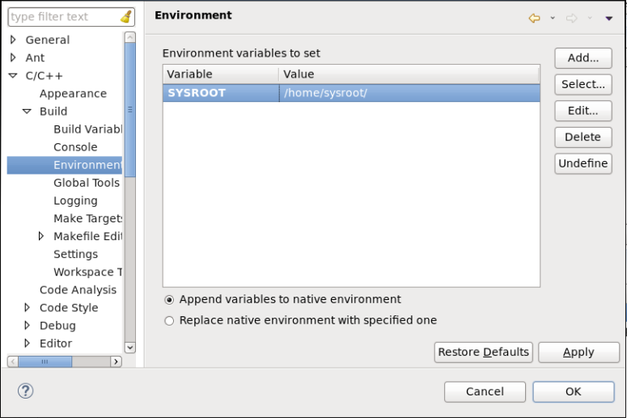

プラットフォームには、プログラマブル ロジックでアクセラレーションされたよく使用される OpenCV 関数のデモを示す 5 つのファイル I/O と 3 つのライブ I/O デザイン例が含まれています。4 つ目のライブ I/O 例は、3 つのライブ I/O デザインを 1 つのデザインにまとめて、3 つのアクセラレーション関数を FPGA に配置して並列実行する方法を示します。

このリリースの reVISION では、ライブ I/O サンプル デザインは GStreamer に基づいています。[GStreamer](https://gstreamer.freedesktop.org/) を参照してください。オープン ソース GStreamer フレームワークのコードが reVISION プラットフォームに含まれており、デザイン例は GStreamer プラグインとしてビルドされます。テスト アプリケーションのコードも提供されており、プラグインを使用してビデオ パイプラインをセットアップして実行するアプリケーションをコンパイルできます。パイプラインは、`gst-launch-1.0` ユーティリティを使用して実行するか、gstreamer ライブラリに対してコンパイルされた独自のアプリケーションにより実行できます。各プラットフォーム サンプル用に gstdemo という名前のテスト アプリケーションの例が提供されています。4 つのサンプル名 (`<names>`) は、`filter2d`、`optical_flow`、`stereo`、および `triple` です。各サンプルの `./workspaces/<name>/gst/apps/<name>` ディレクトリを確認してください。

GStreamer プラグインは共有ライブラリです。reVISION サンプル デザインの場合、GStreamer プラグインはリンクされた 2 つの部分で構成されています。これら 2 つの部分 top および bottom は、個別のプロジェクト ビルドで生成された個別の共有ライブラリです。top 部分は GStreamer プラグイン自体で、GStreamer フレームワークとインターフェイスするためのコードが含まれます。`./workspaces/<name>/gst/plugins/<name>` ディレクトリを確認してください。
top 部分は、ハードウェアでアクセラレーションされる関数のコードを含む bottom 部分にリンクされています。bottom プロジェクトは、ハードウェア関数に使用されるプログラマブル ロジックを含む BOOT.BIN ファイルを生成します。これらは SDx プロジェクトです。`./samples/live_IO/<name>` ディレクトリを参照してください。

## 6.1 live_IO オプティカル フロー サンプル アプリケーションのビルド

次の手順は、Linux または Windows バージョンのどちらの SDx を使用しても基本的に同じです。

プラットフォームの一部として、4 つの live_IO サンプルに対して ` ./workspaces/...` フォルダー構造が既に設定されています。
```
├── workspaces
│   ├── ws_f2d
│   ├── ws_of
│   ├── ws_sv
│   ├── ws_triple

```

これらのワークスペースを、作業用のディレクトリにコピーします。プラットフォームで提供されている optical_flow ワークスペース エリアを見てください。`./gst/` にあるファイルは次のとおりです。`./opticalflow` ディレクトリは SDx プロジェクトで、下位アクセラレータ コードをビルドするためにユーザーが作成します。この opticalflow SDx プロジェクトは、`ws_of` ワークスペースのすぐ下に作成します。`./gst/` も `./ws_of` のすぐ下にあります。
```
├── ws_of
│   ├── gst
│   │   ├── allocators
│   │   │   ├── gstsdxallocator.c
│   │   │   └── gstsdxallocator.h
│   │   ├── apps
│   │   │   └── optical_flow
│   │   │       └── main.c
│   │   ├── base
│   │   │   ├── gstsdxbase.c
│   │   │   └── gstsdxbase.h
│   │   └── plugins
│   │       └── optical_flow
│   │          ├── gstsdxopticalflow.cpp
│   │          └── gstsdxopticalflow.h
│   └── opticalflow
│       └── src
│           ├── optical_flow_sds.cpp
│           └── optical_flow_sds.h

```

`./ws_of/` などワークスペース内では、このディレクトリ構造を保持する必要があります。これは、さまざまなプロジェクトが互いに依存関係にあり、インクルード ファイルおよびライブラリ ファイルへのパスが既知である必要があるからです。この構造を保持していれば、`./ws_of/` ツリーをすべてのサブディレクトリをそのまま別の場所にコピーしても問題ありません。

**:pushpin: 注記:**
>Linux を使用している場合は、ワークスペースを配置する場所に制限はありません。プラットフォームの下にある `./workspaces/` ディレクトリで直接作業することもできますし、元のエリアが変更されないように別の場所にコピーして作業することもできます。

>**Windows を使用している場合は、ファイル パス名は 256 文字までに制限**されます。ザイリンクス ビルド プロセスでは、ビルド プロセスを進めていくと、ディレクトリ構造が深くなり、パス名が長くなります。そのため、ワークスペースのパス名ができるだけ短くなるようにしてください (`C:\ws_of\...` など)。

### 6.1.1 既存の gstreamer ワークスペースのインポート
* SDx を起動してワークスペース `./ws_of` を選択します。$SYSROOT を設定したのと同じシェルで SDx を実行してください。
* Welcome 画面を閉じ、[File] → [Import] → [General] → [Existing Projects into Workspacel] → [Next] をクリックします。

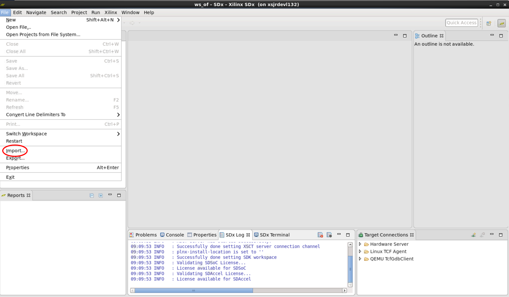


* [Import] ダイアログ ボックスで、[Select root directory] の右側の [Browse] ボタンをクリックします。

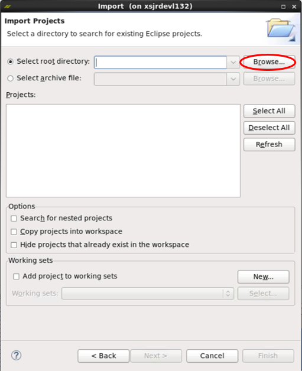

* デフォルトでは既にディレクトリ内にいるので、`./workspaces/ws_of` を指定して [OK] をクリックします。

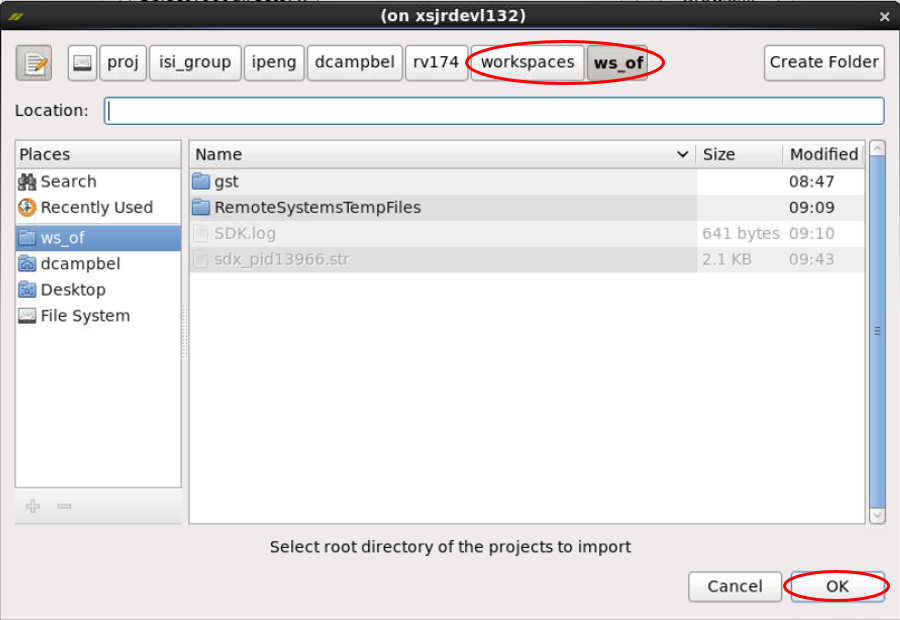

* プロジェクトのリストが表示され、gstdemo、gstsdxallocator、gstsdxbase、および gstopticalflow が選択されています。[Finish] をクリックします。

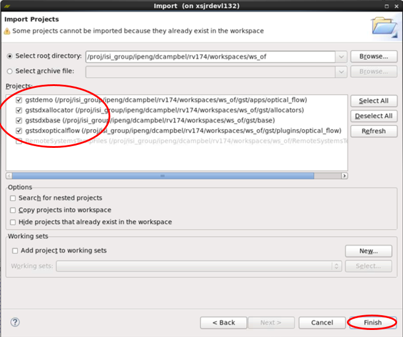

* メイン ウィンドウに戻ると、[Project Explorer] ビューにインポートされたプロジェクトが表示されます。メニュー バーから [File] → [New] → [SDx Project] をクリックします。

### 6.1.2 アプリケーション プロジェクトの作成
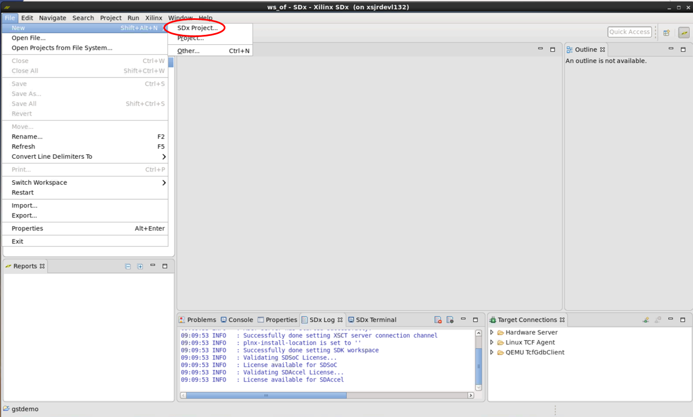

* New SDx Project ウィザードの [Project Type] ページが [Application Project] がオンの状態で表示されます。[Next] をクリックします。

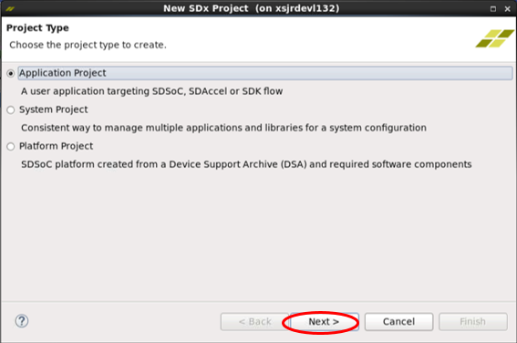

* [Create a New SDx Project] ページで [Project name] に「opticalflow」と入力し、[Next] をクリックします。

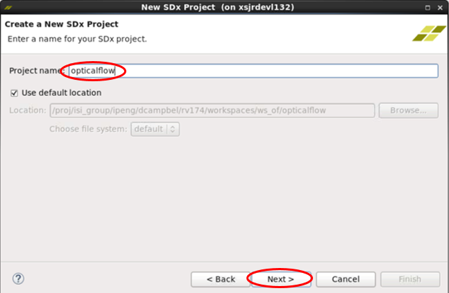

### 6.1.3 カスタム プラットフォームの追加
* [Platform] ページで [Add Custom Platform] をクリックし、reVISION プラットフォームを解凍した最上位ディレクトリ (zcu102_rv_ss など) を選択して、[OK] をクリックします。

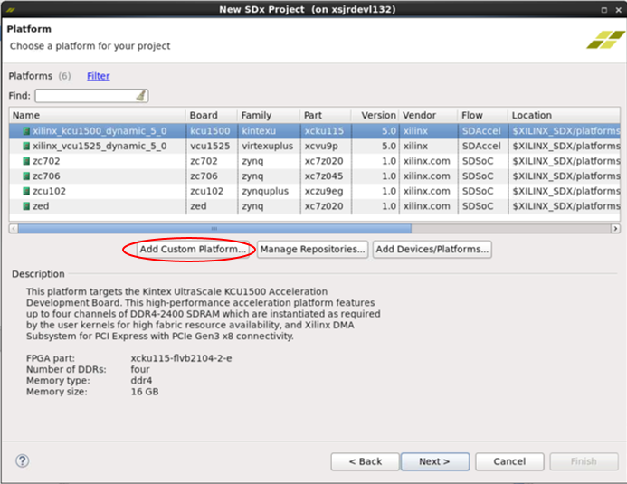

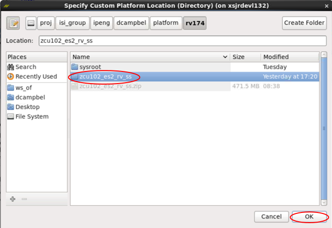

* [Platform] ページに新しいプラットフォームが表示されますが、選択されていません。選択して [Next] をクリックします。

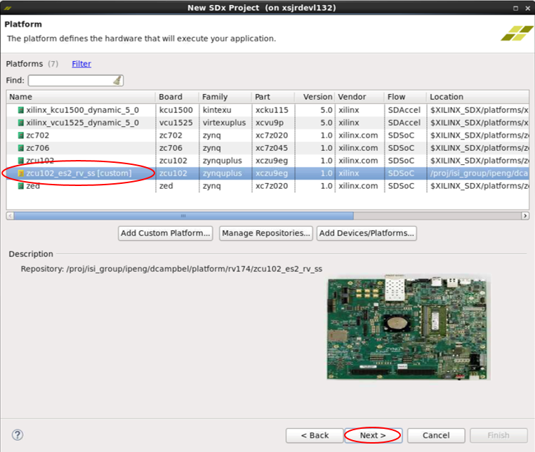

### 6.1.4 Opt 共有ライブラリ
* [System configuration] ページの [Output type] で [Shared Library] をオンにし、[Next] をクリックします。

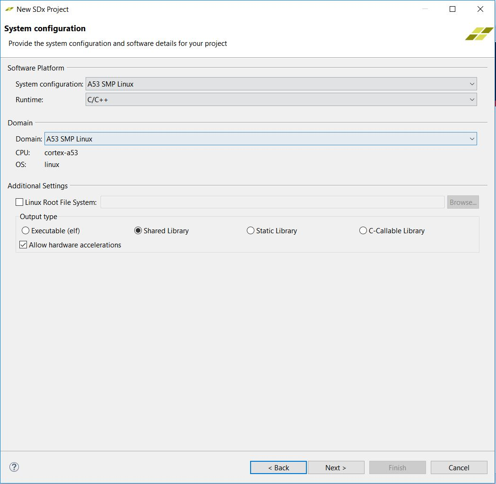

### 6.1.5 ライブ I/O サンプルの選択
* [Templates] ページで [live_IO] の下の [Dense Optical Flow] を選択し、[Finish] をクリックします。

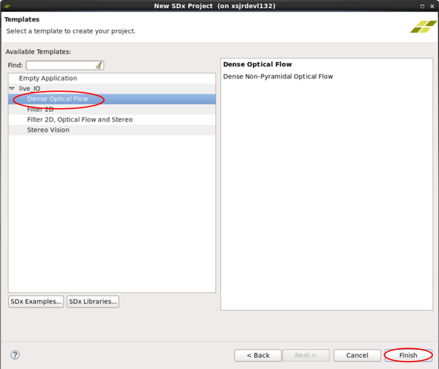

* メイン ウィンドウに戻ると、[Project Explorer] ビューのインポートされた 4 つのプロジェクトの下に新しいプロジェクト opticalflow が表示されます。

### 6.1.6 リリース ビルド コンフィギュレーションの選択
* opticalflow プロジェクトの [Active Build Configuration] を [Release] に変更します。3 つのルーチンがハードウェア関数とマークされていることに注目してください。

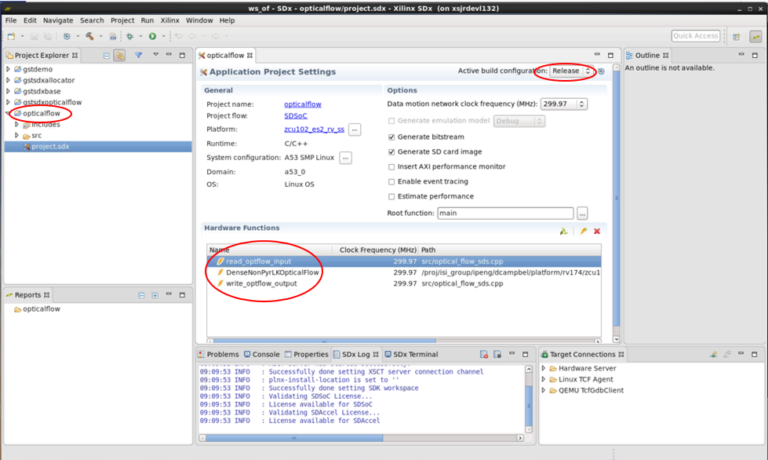

### 6.1.7 プロジェクトのビルド

* opticalflow プロジェクトをビルドします。これには、右クリックして [Build Project] を選択するか、ハンマー アイコンをクリックします。
* 開いた [Build Project] ダイアログ ボックスで [Run in Background] をクリックします。これにより [Build Project] ダイアログ ボックスは閉じますが、GUI の右下に進捗状況バーが表示され、処理が実行中であることがわかります。GUI の下部中央にある [Console] ビューを選択し、ビルド プロセスの進捗状況を確認します。ビルド プロセスには、ホスト マシンの処理能力、Linux または Windows のどちらで実行しているか、およびデザインの複雑性によって、数十分から数時間かかります。ほとんどの時間は、ハードウェアに配置するよう指定されたルーチンの処理に費やされます。[SDx Project Settings] の左下の [Hardware Functions] ペインにリストされているものです。上記の例では、read_optflow_input、DenseNonPyrLKOpticalFlow、および write_optflow_output ルーチンがハードウェアにビルドされます。これらのルーチンの C コードを RTL に合成し、その RTL を Zynq MPSoC のプログラマブル ロジックに配置配線するプロセスに最も時間がかかります。

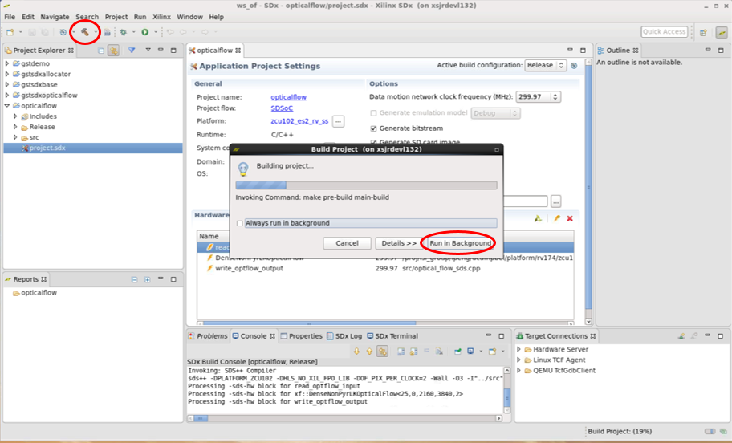

* ビルドが完了すると sd_card ディレクトリが作成されるので、これに含まれるファイルを SD カードにコピーします。
* 次のファイルをコピーして、SD カードに lib および gstreamer-1.0 ディレクトリを作成する必要があります。
  * `cp ./workspaces/ws_of/opticalflow/Release/sd_card/BOOT.BIN <sdcard>`
  * `cp ./workspaces/ws_of/opticalflow/Release/sd_card/libopticalflow.so <sdcard>/lib/`
  * `cp ./workspaces/ws_of/opticalflow/Release/sd_card/image.ub <sdcard>`
  * `cp ./workspaces/ws_of/opticalflow/Release/sd_card/video_cmd <sdcard>`
  * `cp ./workspaces/ws_of/gst/allocators/Debug/libgstsdxallocator.so <sdcard>/lib/`
  * `cp ./workspaces/ws_of/gst/base/Debug/libgstsdxbase.so <sdcard>/lib/`
  * `cp ./workspaces/ws_of/gst/plugins/optical_flow/Debug/libgstsdxopticalflow.so <sdcard>/gstreamer-1.0/`
  * `cp ./workspaces/ws_of/gst/apps/optical_flow/Debug/gstdemo <sdcard>`
* bottom 共有ライブラリがビルドされたので、top 部分をビルドし、bottom ライブラリにリンクします。gstdemo プロジェクトを選択し、ハンマー アイコンをクリックしてビルドします。これにより、4 つの gst--- プロジェクトがすべてビルドされます。

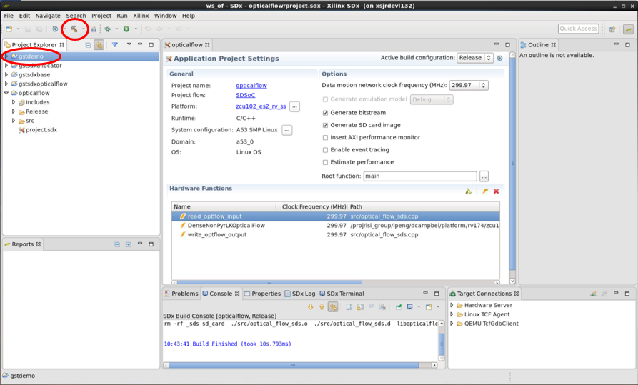

## 6.2 Stereo、Filter2D、および Triple サンプル アプリケーションのビルド

* Stereo、Filter2D、および Triple プロジェクトも、Optical Flow プロジェクトの手順と同じように作成してビルドできます。手順はよく似ています。
* SDx を起動し、適切なワークスペース ディレクトリ `./workspaces/ws_sv`、`./workspaces/ws_f2d`、または `./workspaces/ws_triple` を開きます。
* [Templates] ページで [Stereo Vision]、[Filter2D]、または [Optical Flow and Stereo] を選択します。
* その他すべての手順は同じです。

## 6.3 ファイル I/O サンプル アプリケーションのビルド

* SDx を起動して新しいワークスペース作成します。$SYSROOT を設定したのと同じシェルで SDx を実行してください。
* Welcome 画面を閉じ、メニュー バーから [File] → [New] → [SDx Project] をクリックします。[Application Project] を選択し、[Next] をクリックします。New SDx Project ウィザードが開きます。プロジェクトの名前 (バイラテラル フィルターを表す bil_fil など) を入力します。

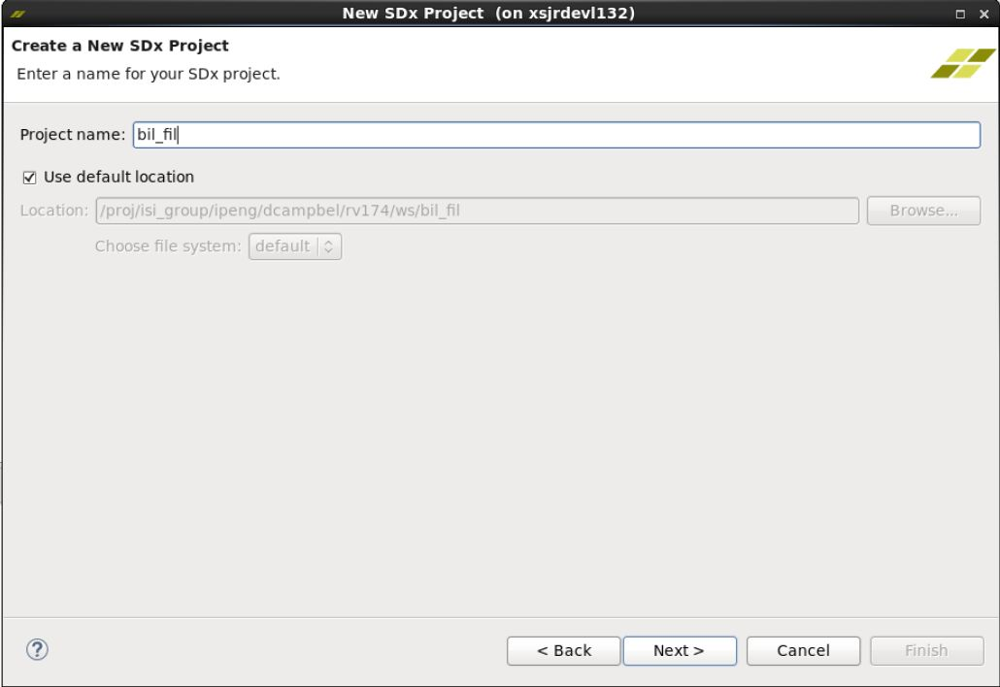

* [Use default location] をオンのままにして [Next] をクリックします。[Platform] ページが開きます。
* プラットフォームを選択します。新しいワークスペースでこれを初めて実行する場合は、[Add Custom Platform] ([6.1.3 カスタム プラットフォームの追加](#613-カスタム-プラットフォームの追加)を参照) をクリックしてカスタム プラットフォームを選択する必要があります。

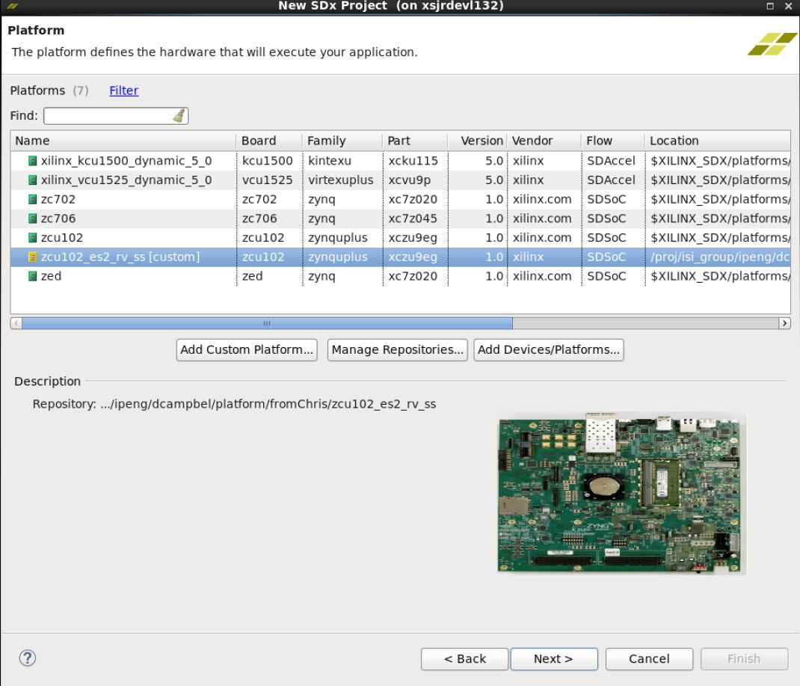

* カスタム プラットフォーム ([zcu102_es2_rv_ss (custom)] など) を選択して [Next] をクリックします。[System configuration] ページが開きます。

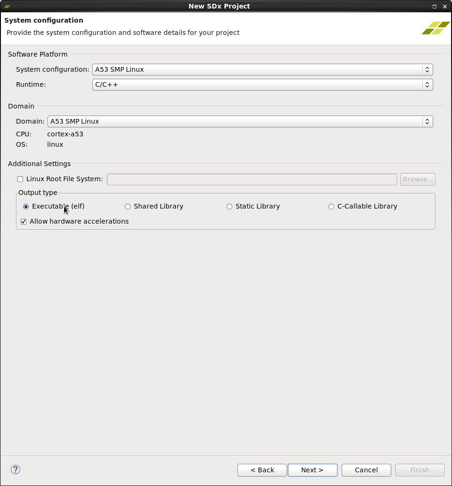

* すべてをデフォルト設定のままにして [Next] をクリックします。[Templates] ページが開きます。
* テンプレートのリストから [bilateral – File I/O] を選択し、[Finish] をクリックします。

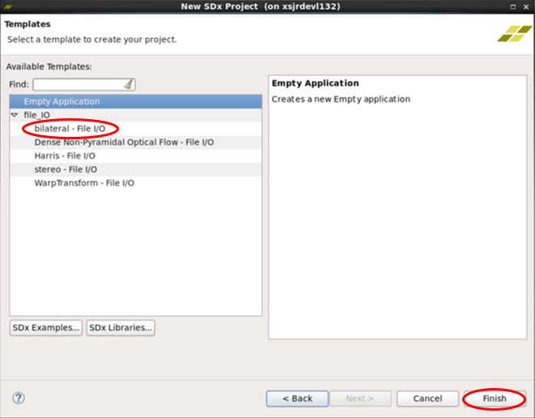

* ウィザードが閉じ、SDx GUI の中央に [SDx Project Settings] が表示されます。このパネルの右下の進捗状況バーに C/C++ Indexer と表示されます。これが終了するのを待ちます。[Application Project Settings] の右上にある [Active build configuration] を [Debug] から [Release] に変更します。ウィンドウの表示は次のようになります。


* 左側の [Project Explorer] ビューで bil_fil プロジェクトを右クリックし、[Build Project] をクリックします。または、ツールバーのハンマー アイコンをクリックしても [Build Project] コマンドを実行できます。開いた [Build Project] ダイアログ ボックスで [Run in Background] をクリックします。これにより [Build Project] ダイアログ ボックスは閉じますが、GUI の右下に進捗状況バーが表示され、処理が実行中であることがわかります。GUI の下部中央にある [Console] ビューを選択し、ビルド プロセスの進捗状況を確認します。ビルド プロセスには、ホスト マシンの処理能力、Linux または Windows のどちらで実行しているか、およびデザインの複雑性によって、数十分から数時間かかります。ほとんどの時間は、ハードウェアに配置するよう指定されたルーチンの処理に費やされます。[SDx Project Settings] の左下の [Hardware Functions] ペインにリストされているものです。bilateralFilter がハードウェアに移動する関数としてリストされています。
* ビルドが完了すると sd_card ディレクトリが次の場所に作成されます。
  * `.\<workspace>\bil_fil\Release\sd_card`
* ボード上で関数を実行するには、ボードに SD カードを挿入して電源を投入します。
* プロンプトで /media/card ディレクトリに移動します。「cd /media/card」と入力します。
* 「./bil_fil.elf im0.jpg」と入力して実行ファイルを実行します。
* 正しく実行されると、ターミナルに次のように表示されます。
```

sigma_color: 7.72211 sigma_space: 0.901059 elapsed time 9133271 Minimum error in intensity = 0 Maximum error in intensity = 1 Percentage of pixels above error threshold = 0.00168789 Count: 35

```

* ほかのファイル I/O サンプル (Harris コーナー検出、オプティカル フロー、ステレオ ブロック マッチング、および warpTransform) にも同じ操作を実行します。


<hr/>

:arrow_forward:**次のトピック:**  [7.  アプリケーションの実行](run-application.md)

:arrow_backward:**前のトピック:**  [5.  インストールおよび操作手順](operating-instructions.md)
<hr/>
<p align="center"><sup>Copyright&copy; 2018 Xilinx</sup></p>
